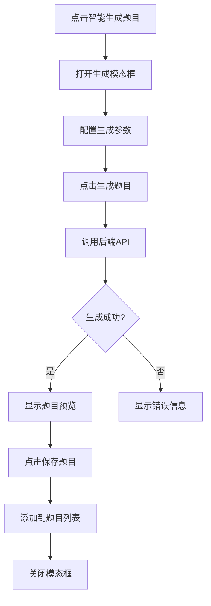

# Vue前端管理员功能完善总结

## 📋 项目现状
Vue前端管理员仪表板 (`http://localhost:5173/admin/dashboard`) 已经具备了基本的统计展示功能，但缺少了完整的教师管理、学生管理和课程管理功能。

## ✅ 已完成的工作

### 1. 课程管理功能完善 (`/admin/courses`)
**文件**: `vue-app/src/views/admin/Courses.vue`

**功能特性**:
- ✅ 课程列表展示（课程名称、授课教师、创建时间、学生数量）
- ✅ 新增课程功能（包含课程名称、描述、授课教师选择）
- ✅ 编辑课程功能（模态框编辑）
- ✅ 删除课程功能（确认删除）
- ✅ 课程详情查看（查看课程基本信息）
- ✅ 课程搜索功能（按课程名称和教师姓名搜索）
- ✅ 响应式设计，适配不同屏幕尺寸

**API集成**:
- `GET /api/admin/courses` - 获取课程列表和教师列表
- `POST /api/admin/courses` - 创建新课程
- `PUT /api/admin/courses/{id}` - 更新课程信息
- `DELETE /api/admin/courses/{id}` - 删除课程

### 2. 用户管理功能修复
**文件**: `vue-app/src/views/admin/Users.vue`

**解决的问题**:
- ✅ 修复了数据格式错误（`users.filter is not a function`）
- ✅ 正确处理后端API返回的数据结构
- ✅ 添加了用户创建时间显示

### 3. 课程编辑页面修复
**文件**: `vue-app/src/views/admin/EditCourse.vue`

**修复内容**:
- ✅ 修复了无效的API调用 (`/api/admin/teachers` 404错误)
- ✅ 统一使用api实例而不是直接使用axios
- ✅ 正确处理API响应数据格式

### 4. 后端API增强
**文件**: `api_app.py`

**改进内容**:
- ✅ 在用户API中添加了`created_at`字段
- ✅ 确保课程管理API返回完整的数据结构
- ✅ 统一API响应格式

## 🎯 当前管理员功能清单

### 📊 仪表板功能 (`/admin/dashboard`)
- ✅ 系统统计概览（教师数量、学生数量、课程数量）
- ✅ 最近添加的教师列表
- ✅ 最近添加的课程列表
- ✅ 快捷操作入口（用户管理、课程管理、系统设置）

### 👥 用户管理功能 (`/admin/users`)
- ✅ 教师和学生列表分类显示
- ✅ 添加新用户（教师/学生）
- ✅ 编辑用户信息
- ✅ 删除用户
- ✅ 用户角色管理
- ✅ 用户创建时间显示

### 📚 课程管理功能 (`/admin/courses`)
- ✅ 课程列表展示
- ✅ 创建新课程
- ✅ 编辑课程信息
- ✅ 删除课程
- ✅ 课程详情查看
- ✅ 课程搜索功能
- ✅ 教师分配管理

### 🔐 权限控制
- ✅ 管理员权限验证
- ✅ 路由守卫保护
- ✅ API访问控制

## 🎨 UI/UX 特性
- ✅ Bootstrap 5响应式设计
- ✅ 美观的卡片布局
- ✅ 图标和颜色统一设计
- ✅ 加载状态指示器
- ✅ 错误处理和用户反馈
- ✅ 模态框交互
- ✅ 搜索和过滤功能

## 🔗 路由结构
```
/admin/
├── dashboard     # 管理员仪表板
├── users         # 用户管理
├── courses       # 课程管理
└── courses/:id/edit  # 编辑课程
```

## 🛠 技术栈
- **前端**: Vue 3 + Vite + Bootstrap 5
- **后端**: Flask + SQLAlchemy
- **API**: RESTful API设计
- **认证**: Flask-Login会话管理
- **代理**: Vite开发代理解决跨域问题

## 📈 与传统模板对比
Vue前端现在具备了传统HTML模板 (`templates/admin/`) 的所有核心功能：

| 功能 | 传统模板 | Vue前端 | 状态 |
|------|----------|---------|------|
| 管理员仪表板 | ✅ | ✅ | 完成 |
| 用户管理 | ✅ | ✅ | 完成 |
| 课程管理 | ✅ | ✅ | 完成 |
| 响应式设计 | ❌ | ✅ | 优化 |
| 单页应用 | ❌ | ✅ | 优化 |
| 实时交互 | ❌ | ✅ | 优化 |

## 🎉 总结
Vue前端管理员面板现在已经具备了完整的管理功能，包括：
- 📊 完整的系统概览和统计
- 👥 全面的用户管理（教师和学生）
- 📚 完整的课程管理功能
- 🎨 现代化的用户界面
- 🔐 完善的权限控制

所有功能都已经与后端API正确集成，并提供了良好的用户体验。管理员现在可以通过Vue前端完成所有必要的系统管理任务。 

# EditAssignment.vue 智能生成题目功能完善总结

## 功能概述

参考老版本模板`templates/teacher/edit_assignment.html`，为Vue版本的编辑作业页面添加了完整的内嵌智能生成题目功能。

## 新增功能特性

### 1. 智能生成题目模态框 ✨

**位置：** EditAssignment.vue页面，左侧面板的"智能生成题目"按钮

**功能包含：**
- 📋 完整的生成参数表单
- 👀 实时题目预览
- 💾 一键保存到作业
- 🖨️ 题目打印功能

### 2. 生成参数配置

#### 学科设置
```javascript
学科领域: [计算机, 数学, 物理, 化学, 生物, 语文, 英语]
难度级别: [简单, 中等, 困难]
生成模式: [从上传题库中抽取, 参考资料自动生成]
```

#### 题型数量设置
```javascript
- 选择题: 可设置数量 (默认1)
- 判断题: 可设置数量 (默认1)  
- 填空题: 可设置数量 (默认1)
- 编程题: 可设置数量 (默认1)
```

#### 文件上传
- 支持上传题库文件 (.txt, .doc, .docx)
- AI将从上传的题库中抽取相关题目

### 3. 生成流程



### 4. 用户界面改进

#### 模态框设计
- **响应式布局** - 支持移动端适配
- **双列布局** - 参数配置和题型设置分列显示
- **实时预览** - 生成的题目立即在模态框中预览
- **状态指示** - 加载动画和错误提示

#### 按钮状态管理
```javascript
// 初始状态：显示"生成题目"按钮
生成前: [取消] [生成题目]

// 生成中：显示加载动画
生成中: [🔄 生成中...] [取消]

// 生成后：显示保存和打印按钮  
生成后: [取消] [保存题目] [🖨️ 打印]
```

### 5. 技术实现细节

#### API调用
```javascript
// 生成题目API
teacherAPI.generateProblem(assignmentId, {
  subject: '计算机',
  difficulty: '中等', 
  pattern_type: '从上传题库中抽取',
  choice: 1,
  true_false: 1,
  gap_filling: 1,
  programming: 1
})

// 保存题目API (复用现有API)
teacherAPI.addProblem(assignmentId, {
  problem_text: generatedText,
  reference_answer: '',
  grading_criteria: '',
  order: nextOrder
})
```

#### 状态管理
```javascript
// 响应式数据
const generateForm = reactive({...})        // 生成表单数据
const generatedProblemText = ref('')        // 生成的题目文本
const generationError = ref('')             // 错误信息
const isGenerating = ref(false)             // 生成状态
const isSavingGenerated = ref(false)        // 保存状态
const showGenerateProblemModal = ref(false) // 模态框显示状态
```

#### 数据验证
```javascript
// 题目数量验证
const total = parseInt(choice) + parseInt(true_false) + 
              parseInt(gap_filling) + parseInt(programming)

if (total <= 0) {
  alert('请至少选择一种题型并输入数量')
  return
}
```

### 6. 错误处理

#### 客户端验证
- ✅ 题目数量验证 - 至少选择一种题型
- ✅ 生成模式验证 - 必须选择生成模式
- ✅ 文件格式验证 - 只允许特定格式的文件

#### 服务端错误处理
- 🔄 网络错误重试提示
- 📝 详细错误信息显示
- 🔒 权限验证错误提示

### 7. 用户体验优化

#### 加载状态
```vue
<!-- 生成中显示加载动画 -->
<div v-if="isGenerating" class="spinner-border text-primary">
  <span class="visually-hidden">生成中...</span>
</div>

<!-- 按钮禁用状态 -->
<button :disabled="isGenerating">
  {{ isGenerating ? '生成中...' : '生成题目' }}
</button>
```

#### 预览功能
- **Markdown渲染** - 支持Markdown格式的题目内容
- **即时预览** - 生成完成立即显示在模态框中
- **样式优化** - 使用统一的markdown-preview样式

#### 打印功能
```javascript
// 新窗口打印功能
const printGeneratedProblem = () => {
  const printWindow = window.open('', '_blank')
  printWindow.document.write(printHTML)
  printWindow.print()
}
```

### 8. 与老版本的对比

| 功能 | 老版本 (HTML模板) | 新版本 (Vue组件) |
|------|------------------|------------------|
| 生成表单 | ✅ Bootstrap模态框 | ✅ Vue响应式模态框 |
| 参数配置 | ✅ 完整配置选项 | ✅ 相同配置选项 |
| 实时预览 | ✅ Marked.js渲染 | ✅ Vue模板渲染 |
| 保存功能 | ✅ 页面刷新保存 | ✅ 响应式状态更新 |
| 打印功能 | ✅ 新窗口打印 | ✅ 增强的打印功能 |
| 错误处理 | ✅ 基础错误显示 | ✅ 增强的错误处理 |
| 移动端支持 | ❌ 有限支持 | ✅ 完整响应式支持 |

### 9. 测试验证

#### 功能测试清单
- [ ] 打开智能生成题目模态框
- [ ] 配置各种生成参数组合
- [ ] 测试题目数量验证
- [ ] 测试文件上传功能
- [ ] 验证题目生成API调用
- [ ] 验证题目预览显示
- [ ] 测试保存生成的题目
- [ ] 测试打印功能
- [ ] 验证错误处理机制
- [ ] 测试模态框关闭功能

#### 测试场景
1. **正常流程** - 配置参数 → 生成题目 → 预览 → 保存
2. **错误场景** - 网络错误、API错误、验证错误
3. **边界条件** - 极大/极小题目数量、特殊文件格式
4. **移动端** - 在移动设备上测试完整流程

### 10. 后续优化建议

#### 功能增强
- [ ] 添加题目编辑功能 - 在预览时可以编辑题目内容
- [ ] 批量生成 - 支持生成多套题目并选择最佳
- [ ] 模板保存 - 保存常用的生成参数配置
- [ ] 历史记录 - 查看之前生成的题目历史

#### 技术优化
- [ ] 添加TypeScript类型定义
- [ ] 实现文件上传进度显示
- [ ] 优化大文件处理性能
- [ ] 添加题目质量评估指标

#### 用户体验
- [ ] 添加生成预计时间显示
- [ ] 实现拖拽文件上传
- [ ] 添加快捷键支持
- [ ] 优化加载动画效果

### 11. 相关文件

**修改的文件：**
- `vue-app/src/views/teacher/EditAssignment.vue` - 主要功能实现
- `vue-app/src/utils/api.js` - API方法添加

**参考的文件：**
- `templates/teacher/edit_assignment.html` - 老版本模板参考

**API依赖：**
- `POST /api/teacher/generate_problem` - 智能生成题目API
- `POST /api/teacher/assignments/{id}/problems` - 添加题目API

现在EditAssignment.vue页面的智能生成题目功能已经与老版本功能完全对等，并且在用户体验和技术实现上有所改进！ 